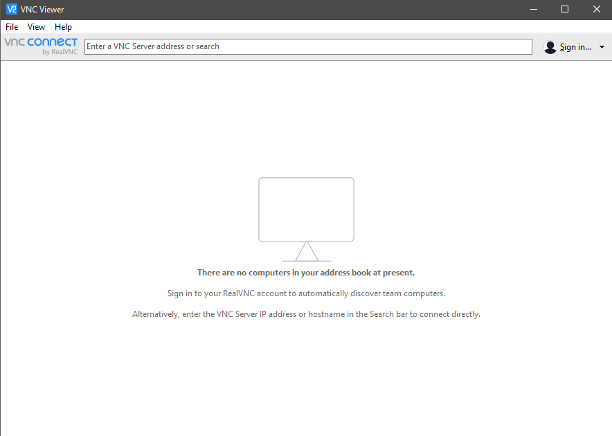
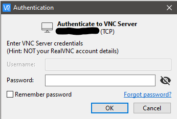

# VPN Setup
The university supplies a VPN solution for accessing the internal network from external sources (E.g. Your home!)

1. Go to http://remote.lincoln.ac.uk/

    

2. Enter your University username and password (e.g. your student account or staff account)

3. Click "continue"

4. On the left-hand side, click "VPN Client (Any Connect)"

    

5. Click "start AnyConnect"

    

6. Click the Download button

    

7. Run the installer
    - Click "Next"
    - Select "I accept the terms in the license agreement" and click "Next"
    - Click "Install"
    - Wait for the install to finish
    - Click "Finish"

8. Open Cisco AnyConnect on your machine
    - You may be required to enter remote.lincoln.ac.uk as your connection target. (Windows should configure this automatically)
    - Click "Connect"

    

9. Enter your University login details in the now open open window

    

10. Click "Accept" on the new prompt

11. You should now be connected to the University supplied VPN and will be able to access the internal network

12. The status of your connection to the VPN is visible via the icon in your Operating System's system tray

    

# Remote Accessing Windows
Feel free to setup the VNC viewer/client of your choice, but the following guide will be using RealVNC's remote client.

1. Go to https://www.realvnc.com/en/connect/download/viewer/

2. Choose your operating system.

    

3. Click the "Download VNC Viewer".

    

4. Run the downloaded installer and follow these steps:
    - Select your language of choice
    - Click "Next"
    - Click "I accept the terms in the License Agreement"
    - Click "Next"
    - Change the install location if needed
    - Click "Next"
    - Click "Install"
    - Click "Finish"

5. Open the "VNC Viewer" application which has been installed.

    

6. Ensure you are on the University supplied VPN (make sure AnyConnect is running and connected), see the above guide if setup is required.

    

7. On the VNC Viewer application, enter your assigned IP address in the "Enter a VNC Server addess or search" box.

    

    

8. Press Enter to launch the connection and click "Continue" on "Unencrypted connection" prompt which will open.

9. Enter your assigned password in the login prompt.

    

10. Press Enter and you should now be connected to the desktop

    

