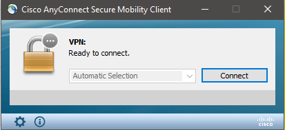
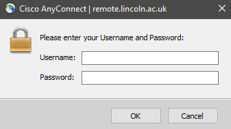

# VPN Setup
The university supplies a VPN solution for accessing the internal network from external sources (E.g. Your home!)

1. Go to http://remote.lincoln.ac.uk/
 
 

2. Enter your University username and password (e.g. your student account or staff account)
 

3. Click "continue"
 

4. On the left-hand side, click "VPN Client (Any Connect)"
 
 

5. Click "start AnyConnect"
 
 

6. Click the Download button
 
 

7. Run the installer
    1. Click "Next"
    2. Select "I accept the terms in the license agreement" and click "Next"
    3. Click "Install"
    4. Wait for the install to finish
    5. Click "Finish"
 

8. Open Cisco AnyConnect on your machine
 
 

9. If required, enter remote.lincoln.ac.uk as your connection target. (Windows should configure this automatically)
 
 

10. Click "Connect"
 
 

11. Enter your University login details in the now open open window
 
 

12. Click "Accept" on the new prompt
 
 

13. You should now be connected to the University supplied VPN and will be able to access the internal network
 
 
